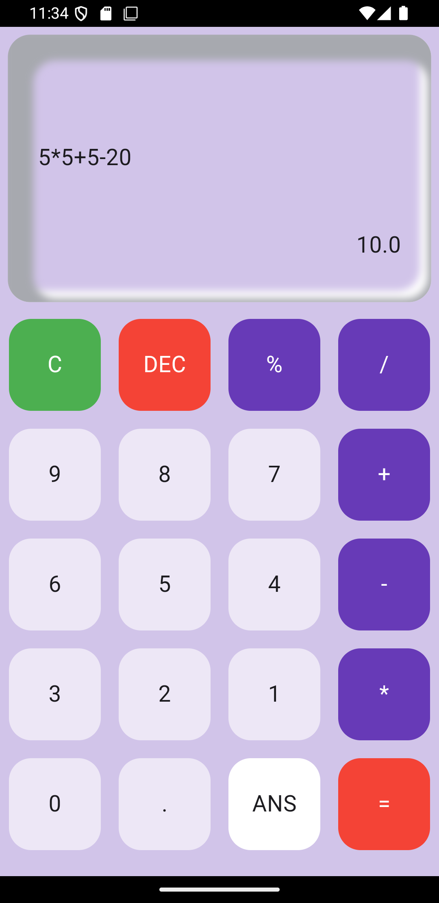

✨ Flutter Calculator App ✨
------------------------------

Welcome to a beautifully crafted and interactive calculator app built with Flutter! This app is designed to provide a smooth and engaging experience for performing basic arithmetic operations. Whether you're adding, subtracting, multiplying, or dividing, this calculator has it all — with style! 🌈
🌟 Key Features:

    Basic Operations ➕ ➖ ✖️ ➗ %
    Clear & Delete 🧹 (Easily reset or remove input)
    Recall Previous Answer 🔁 (Quick access to your last calculation)
    Real-Time Calculation 🧮 (Instant result display)
    Modern UI 🎨 (Clean, smooth, and intuitive design with a custom button layout)

This app uses the math_expressions package to evaluate mathematical expressions 🧑‍💻 and displays results instantly. With its aesthetic design, you’ll enjoy both functionality and a delightful visual experience! 🌸
💡 Why This Calculator?

    Elegant Design: Beautiful box shadows and rounded corners for a modern look.
    Colorful Buttons: A mix of vibrant colors to make every button press feel special. 🌈
    Responsive Layout: Designed to fit perfectly on any screen size. 📱

Enjoy using the calculator and let its smooth animations and clear layout make your calculations a fun experience! ✨

